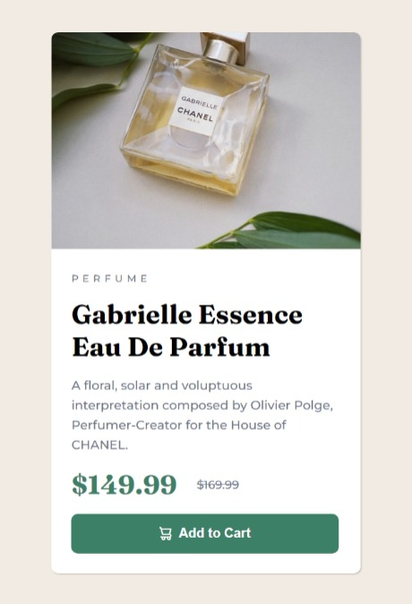

# Frontend Mentor - Product preview card component solution

This is a solution to the [Product preview card component challenge on Frontend Mentor](https://www.frontendmentor.io/challenges/product-preview-card-component-GO7UmttRfa). Frontend Mentor challenges help you improve your coding skills by building realistic projects.

## Table of contents

- [Overview](#overview)
  - [The challenge](#the-challenge)
  - [Screenshot](#screenshot)
  - [Links](#links)
- [My process](#my-process)
  - [Built with](#built-with)
  - [What I learned](#what-i-learned)

## Overview

### The challenge

Users should be able to:

- View the optimal layout depending on their device's screen size
- See hover and focus states for interactive elements

### Screenshot




### Links

- Solution URL: [Add solution URL here](https://www.frontendmentor.io/solutions/responsive-card-component-using-cssandhtml-08-NzbUceA)
- Live Site URL: [Add live site URL here](https://watt92imp.github.io/Product-Preview-Card-using-HTML-CSS./)

## My process

### Built with

- Semantic HTML5 markup
- CSS custom properties
- Flexbox
- Mobile-first workflow

### What I learned

Use this section to recap over some of your major learnings while working through this project. Writing these out and providing code samples of areas you want to highlight is a great way to reinforce your own knowledge.

To see how you can add code snippets, see below:

```html
<div class="card">
  <div class="product">
    
    
  </div>
  <div class="content">
    <span class="product-title">Perfume</span>
    <h1 class="title">Gabrielle Essence Eau De Parfum</h1>
    <p class="info">
      A floral, solar and voluptuous interpretation composed by Olivier Polge,
      Perfumer-Creator for the House of CHANEL.
    </p>
    <div class="price">
      <h2>$149.99</h2>
      <del>$169.99</del>
    </div>
    <button class="btn">
      Add to Cart
    </button>
  </div>
</div>
```

```css
* {
  margin: 0;
  padding: 0;
}
body {
  display: flex;
  min-height: 100vh;
  justify-content: center;
  align-items: center;
  background-color: var(--Cream);
}
.card {
  box-shadow: 1px 1px 2px rgba(0, 0, 0, 0.2);
  background-color: var(--White);
  display: flex;
  border-radius: 0.5rem;
  width: 600px;
}
.product {
  width: 300px;
  height: auto;
  position: relative;
  border-radius: 0.5rem 0 0 0.5rem;
}
.product img {
  width: auto;
  width: 300px;
  min-height: 100%;
  border-radius: 0.5rem 0 0 0.5rem;
}
.content {
  width: auto;
  padding: 1.5rem;
  display: flex;
  flex-direction: column;
  gap: 1.5rem;
  font-family: "Montserrat", sans-serif;
}
.content .title {
  font-family: "Fraunces", serif;
  font-weight: 700;
}
.product-title {
  text-transform: uppercase;
  letter-spacing: 5px;
  font-size: 500;
  font-size: 12px;
  color: var(--Dark-grayish-blue);
}
.info {
  color: var(--Dark-grayish-blue);
  font-size: 15px;
  font-weight: 500;
  line-height: 1.6;
}
.price {
  width: 150px;
  display: flex;
  justify-content: space-between;
  align-items: center;
}
.price h2 {
  font-size: 32px;
  font-family: "Fraunces", serif;
  color: var(--Dark-cyan);
}
.price del {
  text-decoration: line-through;
  color: var(--Dark-grayish-blue);
  font-size: 14px;
  margin-left: 1.5rem;
}
.btn {
  width: 100%;
  background-color: var(--Dark-cyan);
  padding: 15px;
  border: none;
  color: var(--White);
  font-size: 16px;
  font-weight: 700;
  border-radius: 0.5rem;
  cursor: pointer;
}
.btn img {
  margin-right: 0.5rem;
}
.btn:hover {
  background-color: var(--Very-dark-blue);
}
@media screen and (min-width: 900px) {
  .image-mobile {
    display: none !important;
  }
  .image-desktop {
    display: block !important;
  }
}
@media screen and (max-width: 600px) {
  .image-desktop {
    display: none !important;
  }
  .image-mobile {
    display: block !important;
  }
  .card {
    flex-direction: column;
    max-width: 375px;
    width: 100%;
    justify-content: center;
  }
  .content {
    width: 100%;
    max-width: 325px;
    height: auto;
    gap: 1rem;
  }
  .product {
    width: 100%;
  }
  .product img {
    width: 100%;
    border-radius: 0.5rem 0.5rem 0 0;
  }
  .btn {
    max-width: 375px;
    width: 100%;
  }
}
```
